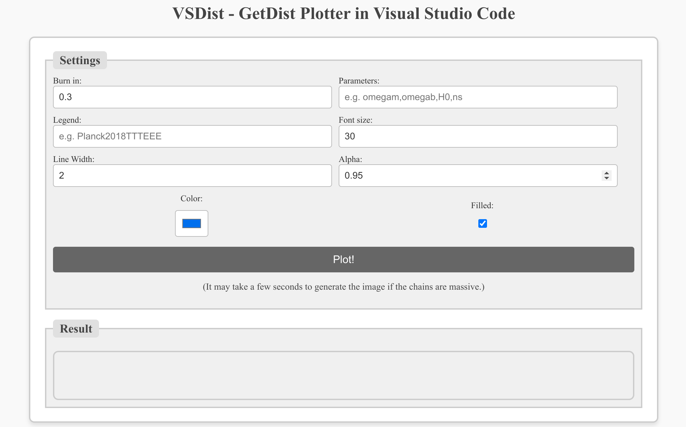

# VSDist

VSDist is a VScode extension that helps you analyse MCMC chain files generated by Cobaya.

Github Repository: https://github.com/astrobai/vsdist.

# Usage

After installing the extension, you can analyse a chain folder by right-clicking on it and selecting the command "VSDist: Analyse Chains". Then the extension will show up a new tab with some simple settings.

In most cases, you only need to fill in the parameters you are interested in, then click the "Plot!" button to generate the plots. The plots will be shown in the result panel.

If you have done all the things correctly, but the plots are not showing up, please report the issue which will help me improve the extension.

# TBD Features

- Add analysis for marge-stats and like-stats

# Some Notes

The reason why I created this extension is that I want a quick and easy way to check the status of the MCMC results, so as you may have noticed, I only implemented the most basic features. So the extension is not that professional and can only act like a simple tool for previewing the results.

